

 

**Computer Engineering graduate** · Y. O. Paton Vocational College of Welding and Electronics
*Comfortable across the stack — Cisco networks, ESP32/AVR firmware, PHP & Python backends, and a Dockerized home lab.*
*I like taking a project past "it compiles" — reviewing my own code, hardening it, and covering it with tests.*

📍 Based in **Prague, Czechia 🇨🇿** — already here, no relocation needed · open to **on-site, hybrid or remote** · open to **Middle** roles

---

### 🛠️ Tech I work with

 

 

---

### 🚀 Projects

#### 🌐 Web & backend

<table>
<tr>
<td width="50%" valign="top">
<a href="https://github.com/BreraDMR/nodra">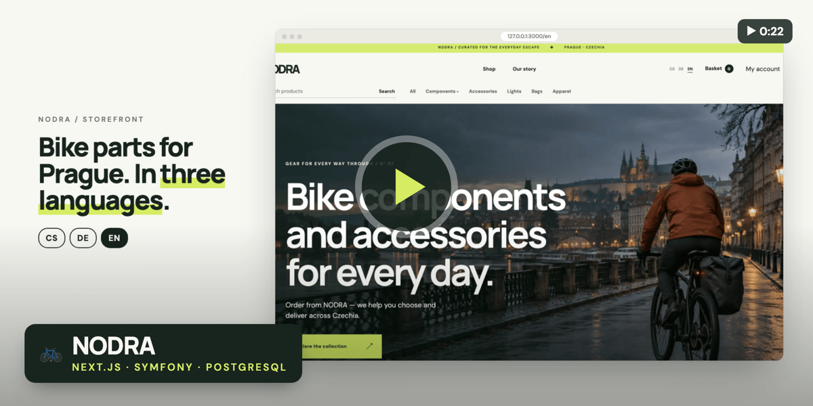</a>
 <b><a href="https://github.com/BreraDMR/nodra">NODRA</a></b> ▶ <i>video inside</i> 
Bike-parts store for Prague with a real back office: confirm with the customer, buy from the supplier, hand over, record the money. 
Next.js 16 · Symfony 8 · PostgreSQL · 300 API tests
</td>
<td width="50%" valign="top">
<a href="https://github.com/BreraDMR/symfony-eshop">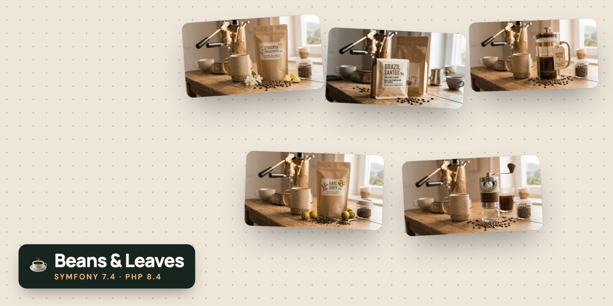</a>
 <b><a href="https://github.com/BreraDMR/symfony-eshop">Beans & Leaves</a></b> 
Coffee & tea shop: catalogue, cart, checkout with a pluggable payment gateway, admin, Redis cache, RabbitMQ mail, Elasticsearch, CI. 
Symfony 7.4 · PHP 8.4 · Doctrine
</td>
</tr>
<tr>
<td width="50%" valign="top">
<a href="https://github.com/BreraDMR/sphynx-cattery-website">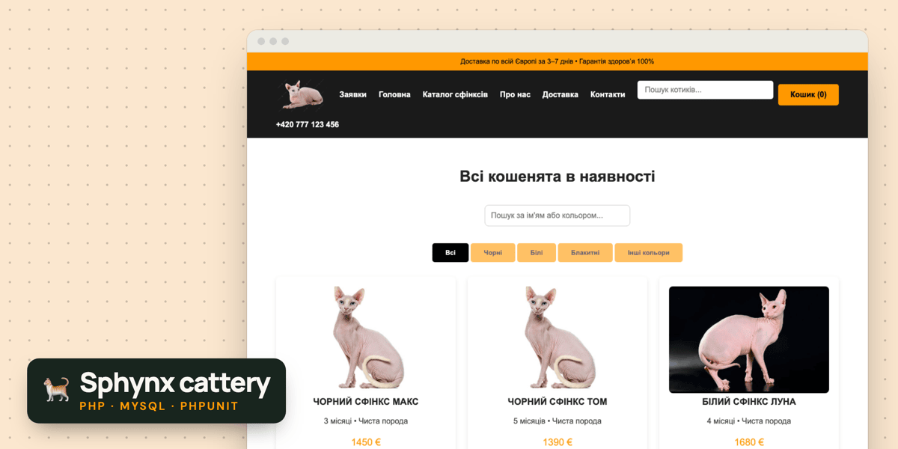</a>
 <b><a href="https://github.com/BreraDMR/sphynx-cattery-website">Sphynx cattery website</a></b> 
PHP/MySQL CRUD site, reviewed and rebuilt: fixed broken auth, closed CSRF/XSS holes, added a repository layer and PHPUnit tests. 
PHP · MySQL · JS
</td>
<td width="50%" valign="top">
<a href="https://github.com/BreraDMR/homelab-wsl">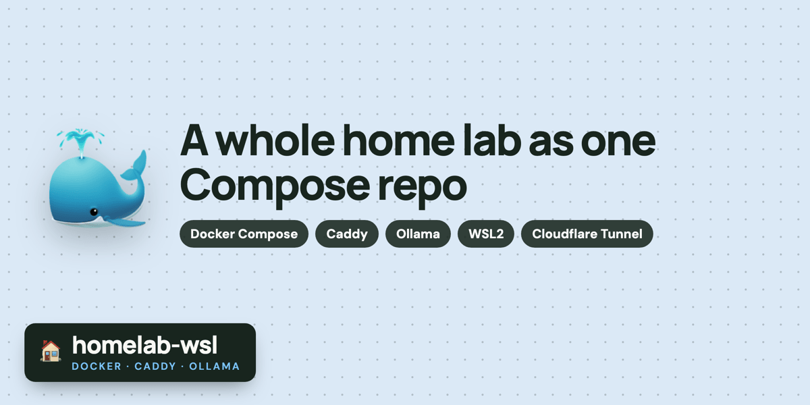</a>
 <b><a href="https://github.com/BreraDMR/homelab-wsl">homelab-wsl</a></b> 
My home lab as Docker Compose in WSL2: Caddy reverse proxy, shared local Ollama, sites and bots, one-command bring-up. 
Docker · Caddy · Ollama · WSL2
</td>
</tr>
</table>

#### 🤖 Telegram bots

<table>
<tr>
<td width="50%" valign="top">
<a href="https://github.com/BreraDMR/pc-control-bot">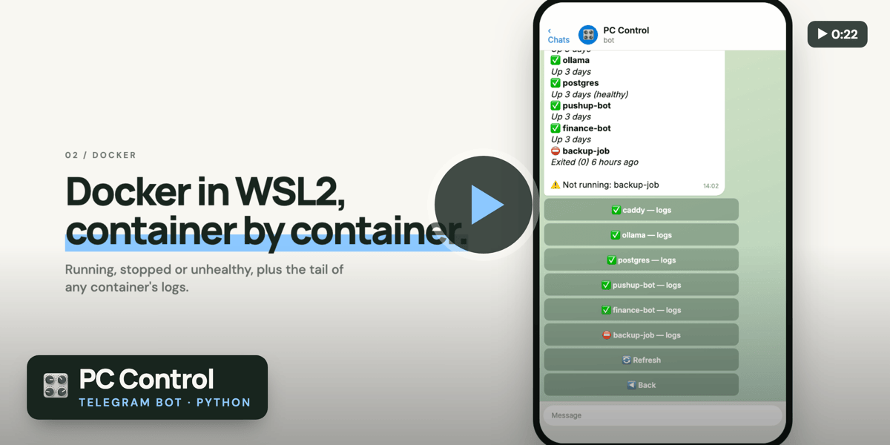</a>
 <b><a href="https://github.com/BreraDMR/pc-control-bot">pc-control-bot</a></b> ▶ <i>video inside</i> 
Telegram remote for a Windows PC: power, screenshots, webcam, Docker/WSL2 status, all button-driven and owner-only. 
Python · python-telegram-bot · psutil
</td>
<td width="50%" valign="top">
<a href="https://github.com/BreraDMR/pc-tele-monitor-ai">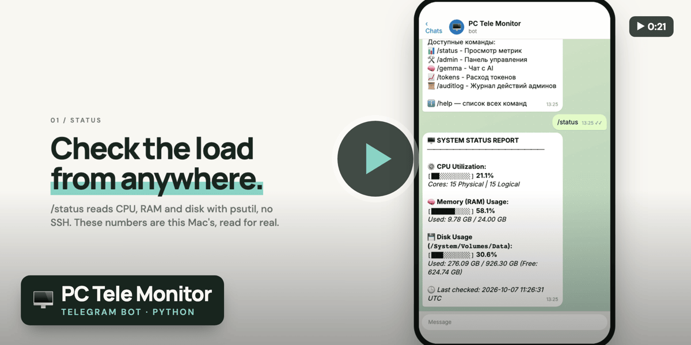</a>
 <b><a href="https://github.com/BreraDMR/pc-tele-monitor-ai">pc-tele-monitor-ai</a></b> ▶ <i>video inside</i> 
Telegram bot for a headless PC: live CPU/RAM/disk metrics, approval-gated access and an optional local-AI chat. 
Python · aiogram · psutil · Ollama
</td>
</tr>
<tr>
<td width="50%" valign="top">
<a href="https://github.com/BreraDMR/finance-tracker-bot">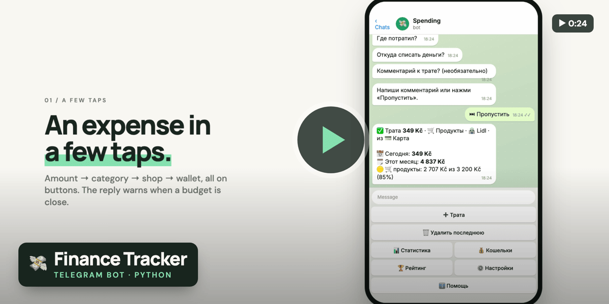</a>
 <b><a href="https://github.com/BreraDMR/finance-tracker-bot">finance-tracker-bot</a></b> ▶ <i>video inside</i> 
Expenses by category and shop, storage places with transfers, families, budgets and multi-currency. 
Python · SQLite · matplotlib
</td>
<td width="50%" valign="top">
<a href="https://github.com/BreraDMR/cigarette-counter-bot">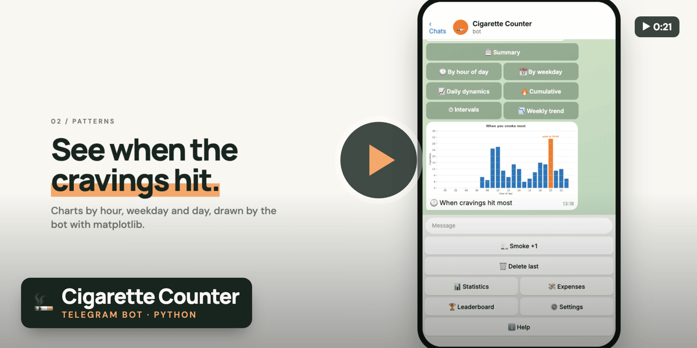</a>
 <b><a href="https://github.com/BreraDMR/cigarette-counter-bot">cigarette-counter-bot</a></b> ▶ <i>video inside</i> 
Habit tracker where fewer ranks higher: hour and weekday charts, real consumable costs in three currencies. 
Python · SQLite · matplotlib
</td>
</tr>
<tr>
<td width="50%" valign="top">
<a href="https://github.com/BreraDMR/pushup-counter-bot">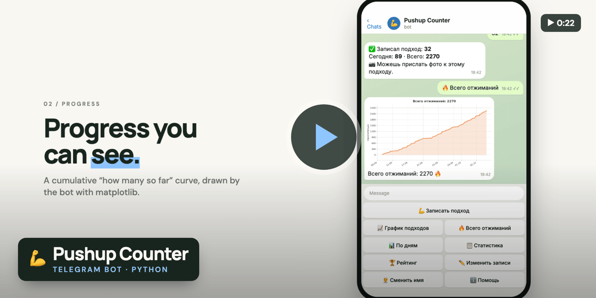</a>
 <b><a href="https://github.com/BreraDMR/pushup-counter-bot">pushup-counter-bot</a></b> ▶ <i>video inside</i> 
Two-tap pushup logging, progress charts, a shared leaderboard and photos. 
Python · SQLite · matplotlib
</td>
<td width="50%" valign="top">
<a href="https://github.com/BreraDMR/sphynx-cats-crm-bot">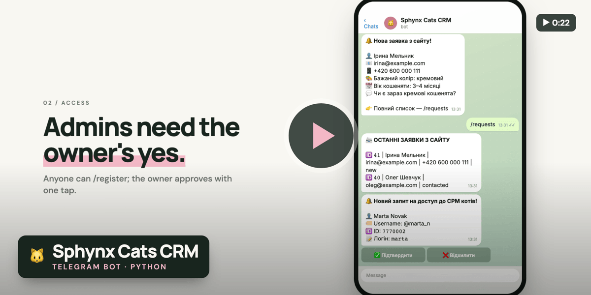</a>
 <b><a href="https://github.com/BreraDMR/sphynx-cats-crm-bot">sphynx-cats-crm-bot</a></b> ▶ <i>video inside</i> 
Telegram CRM for the cattery catalogue: owner-approved admins and AI-assisted description review. 
Python · aiogram · Ollama
</td>
</tr>
</table>

#### 🔌 Embedded, networks & desktop

<table>
<tr>
<td width="50%" valign="top">
<a href="https://github.com/BreraDMR/EQF_L5">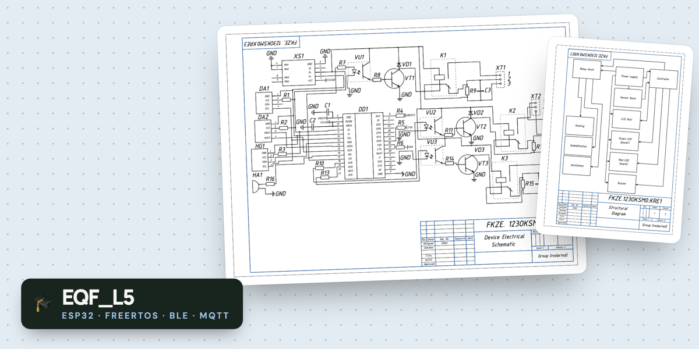</a>
 <b><a href="https://github.com/BreraDMR/EQF_L5">EQF_L5</a></b> 
Diploma: dual-core ESP32 air-quality monitor and controller, ventilation/heating relays, reports over BLE and MQTT. 
C++ · FreeRTOS · PlatformIO
</td>
<td width="50%" valign="top">
<a href="https://github.com/BreraDMR/air-quality-monitor-atmega328p">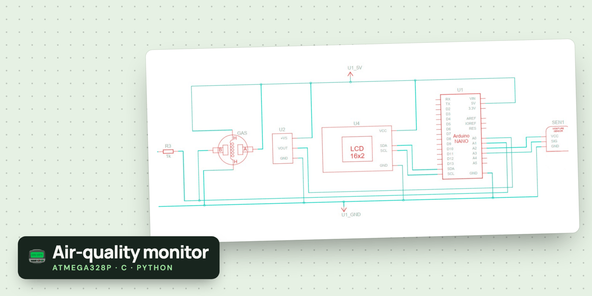</a>
 <b><a href="https://github.com/BreraDMR/air-quality-monitor-atmega328p">air-quality-monitor</a></b> 
AVR air-quality analyzer: DHT11 + MQ-2 on a 16x2 LCD, calibration routine, unit-tested sensor math. 
C (AVR) · Python
</td>
</tr>
<tr>
<td width="50%" valign="top">
<a href="https://github.com/BreraDMR/enterprise-network-cisco">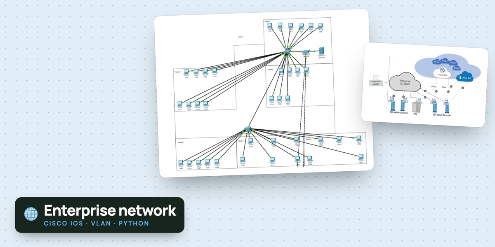</a>
 <b><a href="https://github.com/BreraDMR/enterprise-network-cisco">enterprise-network-cisco</a></b> 
3-floor enterprise network design: VLAN/subnet plan, Cisco IOS configs, cost calculator with 14 unit tests. 
Cisco IOS · Python
</td>
<td width="50%" valign="top">
<a href="https://github.com/BreraDMR/tabscreen">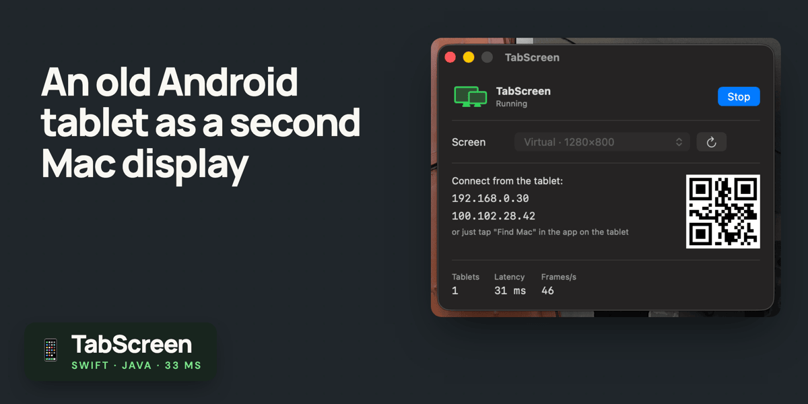</a>
 <b><a href="https://github.com/BreraDMR/tabscreen">tabscreen</a></b> 
Turns an old Android tablet into a second Mac display over Wi-Fi: 33 ms end-to-end, no subscription, no cables. 
Swift · Java · ScreenCaptureKit
</td>
</tr>
<tr>
<td width="50%" valign="top">
<a href="https://github.com/BreraDMR/home-asis">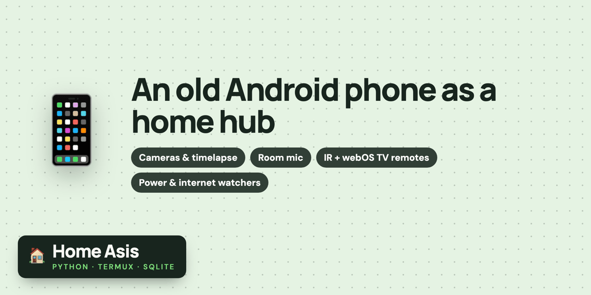</a>
 <b><a href="https://github.com/BreraDMR/home-asis">home-asis</a></b> 
An old Android phone as a home hub: cameras, a rolling timelapse, IR + webOS TV remotes, power and internet watchers. 
Python · Termux · SQLite
</td>
<td width="50%" valign="top">
<a href="https://github.com/BreraDMR/calculating_student_grades">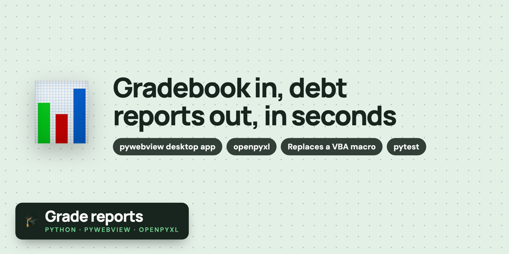</a>
 <b><a href="https://github.com/BreraDMR/calculating_student_grades">calculating_student_grades</a></b> 
Desktop app that scans an Excel gradebook and builds debt and failing-grade reports in seconds, replacing a VBA macro. 
Python · pywebview · openpyxl
</td>
</tr>
</table>

> A recurring theme above: I don't just ship coursework — I go back and **review, fix, and test** it. Auth/CSRF/XSS fixes, unit tests, repository patterns, reproducible Docker setups.

---

### 📊 GitHub stats

---

### 📫 Get in touch

Open to Middle-level opportunities — feel free to reach out.

<!-- profile README -->

